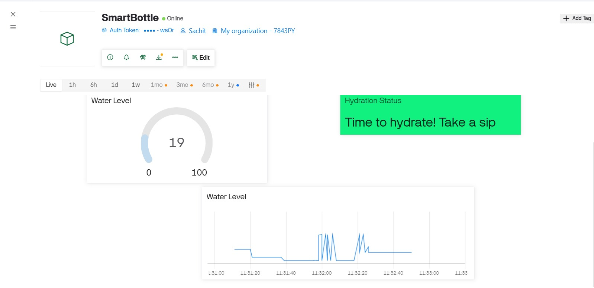

# Smart Water Bottle Hydration Tracker

## Project Overview
This repository contains the firmware and configuration files for an IoT-based Smart Water Bottle. The system monitors user hydration by calculating real-time water levels and detecting drinking motions via bottle tilt. It integrates with the Blynk IoT platform for live dashboard monitoring and status alerts.

## 📊 Dashboard Preview

## Hardware Components
* ESP32 Development Board
* MPU6050 Accelerometer & Gyroscope (Configured for tilt and motion detection)
* HC-SR04 Ultrasonic Distance Sensor (Configured for fluid level monitoring)

## Software & Dependencies
* Arduino Framework
* MPU6050 Library by Electronic Cats
* Blynk ESP32 Library

## Blynk Dashboard Configuration
To replicate the monitoring environment, configure the Blynk web dashboard with the following datastreams:

| Datastream Name    | Virtual Pin | Data Type | Range     |
|--------------------|-------------|-----------|-----------|
| Water Level        | V0          | Integer   | 0 to 100  |
| Hydration Status   | V1          | String    | N/A       |

## Setup and Installation
1. Clone this repository or download the source code ZIP.
2. Open the project in your preferred IDE (VS Code with PlatformIO or Arduino IDE).
3. Open `sketch.ino` (or `main.cpp`) and locate the configuration block at the top of the file.
4. Replace the following placeholder credentials with your actual network and Blynk configurations:
   - `BLYNK_TEMPLATE_ID`
   - `BLYNK_TEMPLATE_NAME`
   - `BLYNK_AUTH_TOKEN`
   - `ssid` (Local WiFi Network Name)
   - `password` (Local WiFi Password)
5. Compile the code and upload the firmware to the ESP32 board.

## Simulation Notes
The hardware configuration and logic can be simulated directly on the Wokwi platform using the provided `diagram.json` and `libraries.txt` files. Ensure all pin mappings align with the documented hardware configuration.
